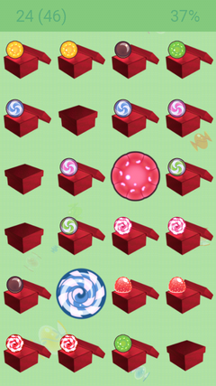

Candy Memory
============

.. image:: https://circleci.com/gh/tube42/candymem/tree/master.svg?style=svg
    :target: https://circleci.com/gh/tube42/candymem/tree/master

.. image:: https://travis-ci.org/tube42/candymem.svg?branch=master
    :target: https://travis-ci.org/tube42/candymem

This is a FOSS memory game for Android.

.. raw:: html
    
    

Screenshot
----------

Acknowledgements
----------------

The candy graphics was extracted from public domain images created by the talented Luisa Midori ( @lumimae on twitter ).

Building
--------

To build this app, you will need java, ant, android SDK and all that

To build the project and run on desktop
::
  ./gradlew desktop:run

To build for android and upload it to your device
::
  ./gradlew debugInstall

Assets
------

Asset sources are found under the extra folder. To compile assets you will need the following tools:

1. ImageMagic for converting PNG images
2. Inkscape for rendering SVG files
3. The rest are downloaded during setup
::
  make setup

To build the assets, you should do
::
  make

Notes
-----

This projects follows the standard Java coding style with one exception: private stuff is snake_case ;)

